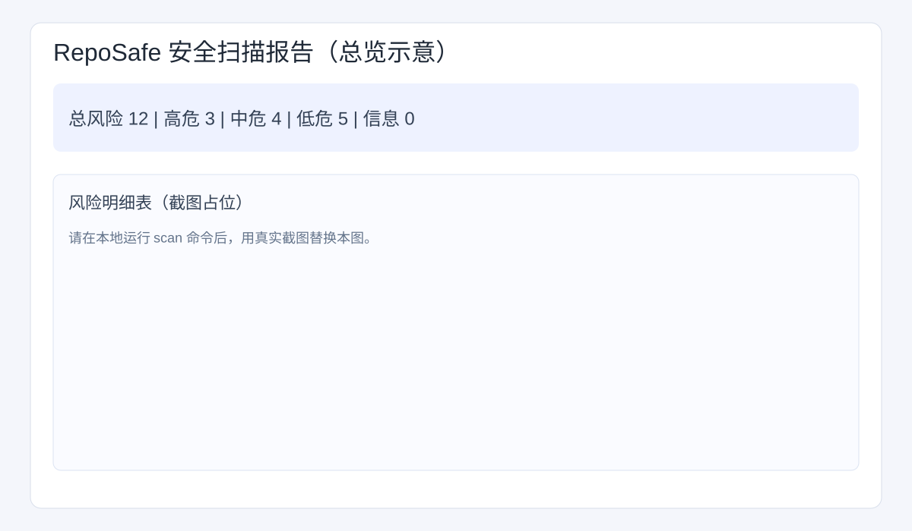
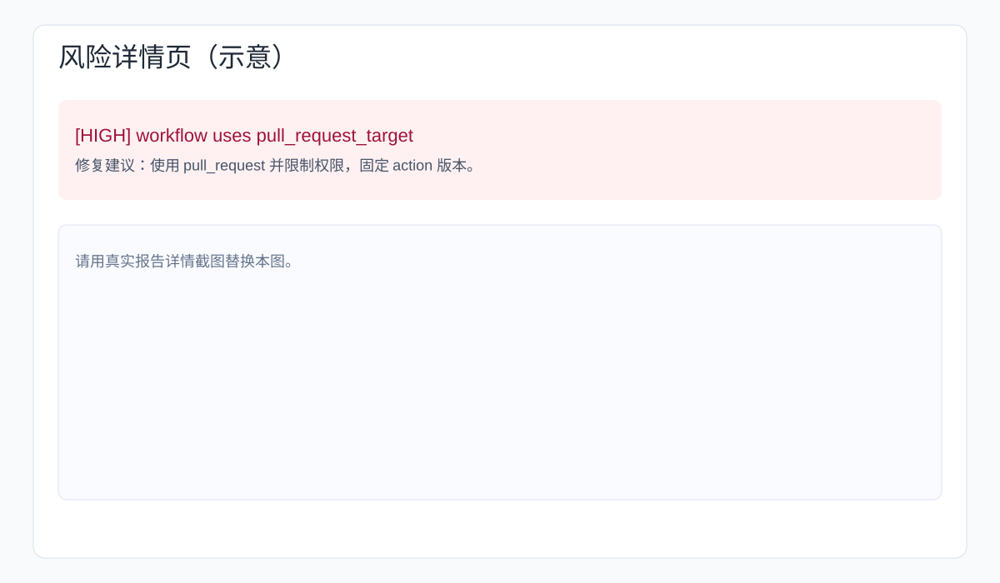

# RepoSafe

Lightweight open-source repository security scanning tool.

## 功能概览

- 敏感信息泄露检测（API Key/Token/JWT/私钥片段等）
- 依赖配置风险检测（未固定版本、通配符版本、宽泛版本范围）
- CI / GitHub Actions 风险检测（`pull_request_target`、`curl | bash` 等）
- 开源项目安全基线检测（关键文档缺失、风险文件存在）
- 统一扫描与多格式报告（Console / JSON / HTML）

Quick start

1. Create and activate a Python 3.10+ virtual environment:

```bash
python3 -m venv .venv
source .venv/bin/activate
```

2. Install dependencies from `requirements.txt`:

```bash
pip install --upgrade pip
pip install -r requirements.txt
```

3. Run tests:

```bash
pytest -q
```

4. Run RepoSafe (examples):

```bash
python -m reposafe.cli scan ./examples/vulnerable_repo
python -m reposafe.cli scan ./examples/vulnerable_repo --format json --out report.json
python -m reposafe.cli scan ./examples/vulnerable_repo --format html --out report.html
python -m reposafe.cli secrets ./examples/vulnerable_repo
```

## 演示说明

推荐用于答辩/申报演示的流程：

1. 运行统一扫描并展示终端输出（可看到严重等级、规则 ID、修复建议、路径、行号、统计总览）。
2. 生成 `report.json` 并展示结构化字段（`metadata` + `findings`）。
3. 生成 `report.html` 并展示报告首页（总风险、高中低危分布、扫描路径与时间）。
4. 展示风险详情行（规则 ID + 修复建议 + 文件路径 + 行号）。

常用演示命令：

```bash
python -m reposafe.cli scan ./examples/vulnerable_repo
python -m reposafe.cli scan ./examples/vulnerable_repo --format json --out report.json
python -m reposafe.cli scan ./examples/vulnerable_repo --format html --out report.html
open report.html
```

## 报告截图

> 当前仓库先放置了示意图，便于文档排版；可在你录制演示后用真实截图替换同名文件。

### HTML 报告首页（示意）



### 风险详情页（示意）



Notes:

- If you prefer editable install, run `pip install -e .` to make local changes available to Python.
- For CI or packaging, use the `pyproject.toml` provided.

